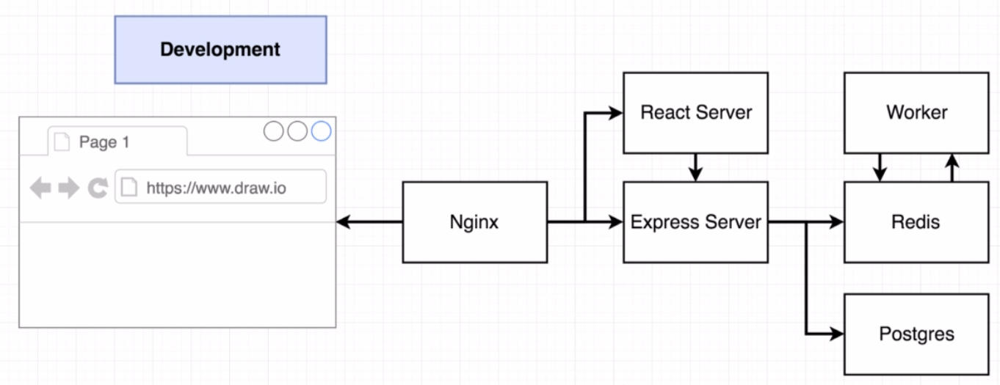
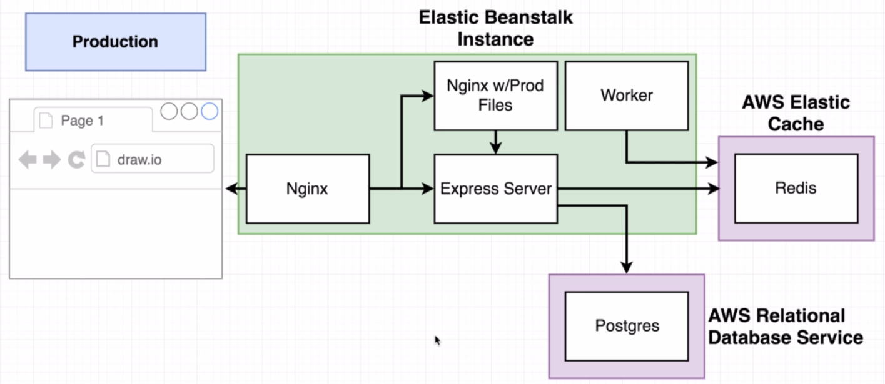
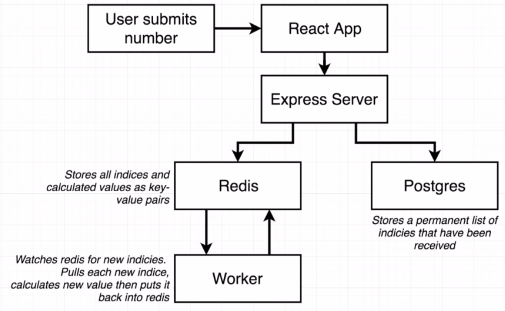
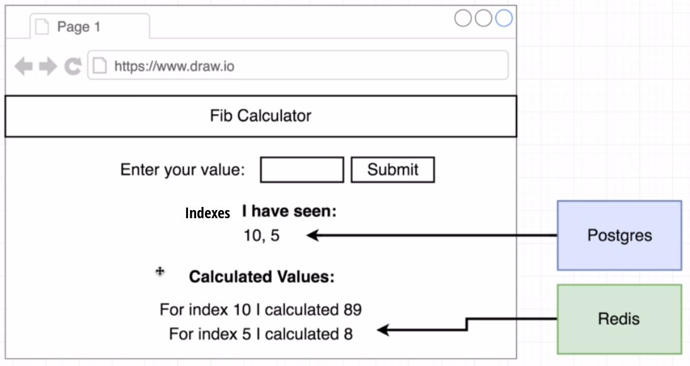
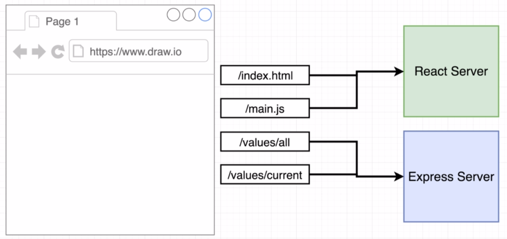
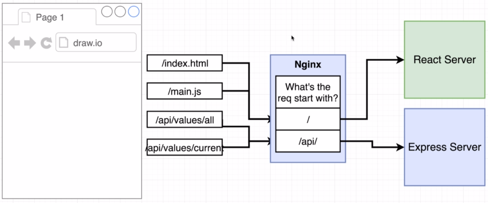
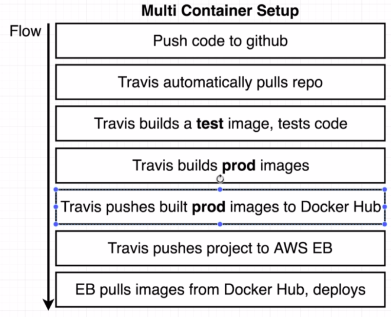

# Architecture

## Development


## Production


## Overall


## From Browser perspective

*Should be "Indicies I have seen:"*

### Where requests go to


### Nginx as reverse proxy


## Deployment process


### Container definitions
In our case it is a `Dockerrun.aws.json`
```json
{
    "AWSEBDockerrunVersion": 2,
    "containerDefinitions": [
        {
            "name": "a name that will be displayed at AWS console (can be named anything) - client",
            "image": "an identifier on the docker-hub yuriiknowsjava/complex-client-prod",
            "hostname": "DNS name inside the generated network (can be named anything) - client", // hostname is an optional field, and if you have a contaier that won't be requested from any other containers, in our case there are nginx and worker (listens to redis), you can skip it.
            "essantial": false, // when set to true and this container crushed, all of the ather containers will stop working.
            "memory": 128 // in MB
        },
        //.....
        {
            "name": "nginx",
            "image": "yuriiknowsjava/complex-nginx-prod",
            "essential": true,
            "memory": 128, // in MB
            "portMappings": [
                {
                    "hostPort": 80,
                    "containerPort": 80
                }
            ],
            "links": ["client", "server"] // connects to containers with names client and server.
        }
    ]
}
```
